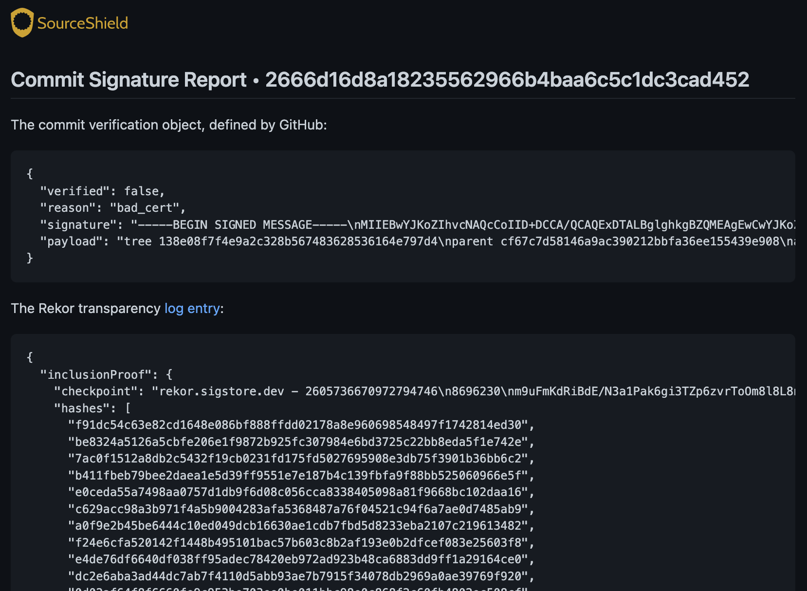

# Examples
SourceShield supports a variety of use cases and is infinitely customizeable to your workflows and security requirements. The examples below are just a few ways to configure SourceShield:

### Require Additional Reviews on Pull Requests from New GitHub Accounts
Open source maintainers often deal with pull requests that are spammy (at best) or malicious (at worst). The SourceShield configuration below will require an additional review from "maintainerA" before the PR check passes if the PR author's GitHub account is less than 10 days old.

```yaml
reviews:
  count: 2
  required:
    - maintainerA

security_checks:
  author_account_age:
    behavior: review
    config:
      min_age_days: 10
```

### Block Merging if Commits are not Signed by Gitsign (Sigstore)
Organizations that are adopting [Gitsign](https://github.com/sigstore/gitsign) for keyless signing of commits may wish to enforce Gitsigned commits for certain repositories. GitHub does not yet support Gitsign natively (commits will show as "unverified"). The example configuration below will reject a pull request if the latest commits are not properly signed by Gitsign and recorded in the [Rekor transparency log](https://github.com/sigstore/rekor).

```yaml
security_checks:
  signed_commits:
    behavior: block
    config:
      gitsign_support: enforced
```

### Block Merging if a Pull Request is Submitted by an Untrusted Bot
Some bots are nice (like Dependabot). Others might not be as nice. SourceShield can be configured to block merging of pull requests submitted by untrusted bots.

```yaml
security_checks:
  author_is_bot:
    behavior: block
    config:
      allowed_bots:
        - dependabot
```

### Debug Commits Signed with Gitsign (Sigstore)
SourceShield's `/sourceshield sigstore` command returns debug information about the most recent commit on a given pull request:

```
/sourceshield sigstore
```

SourceShield will then leave a comment on the PR with the full debug information.

