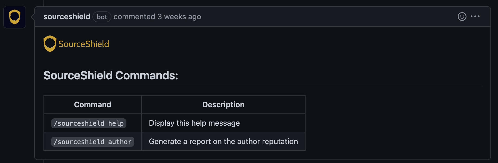

# Getting Started

## Requirements
SourceShield can be installed on GitHub user accounts or GitHub Organizations. SourceShield does not currently support GitHub Enterprise Cloud or self-hosted, but support for these platforms is coming soon.

{: .warning }
SourceShield is currently in beta and only functions on public repositories. To participate in our beta program for private repository support, please submit your interest [here](https://docs.google.com/forms/d/e/1FAIpQLSeHOxckS_aCSu5rzsYHVTrEEjInfNcTAngzZF2BwDAozb7RpQ/viewform?usp=sf_link).

## Installing SourceShield
SourceShield is installed as a GitHub Application.

[Install on GitHub](https://github.com/apps/sourceshield){: .btn .btn-purple }

At installation time, you can select which GitHub repositories SourceShield has access to.

## Configuring SourceShield

{: .note }
By default, SourceShield will not run on any repository, pull request, or issue until a configuration file is defined.

A configuration file, called `sourceshield.yml` must be created in the `.github` folder of each repository you want to enable SourceShield on. Within the `.github/sourceshield.yml` file, you can define the exact way in which SourceShield should operate within the given repository of your GitHub account or organization.

For more information on the config file format, see [Config File Reference](/config_file.html).

## Testing the Installation
Once SourceShield has been installed and the `.github/sourceshield.yml` config file has been committed to the main branch of a repository, you can test that SourceShield is working by picking an existing GitHub issue, or creating a new one, and submitting the following text as a comment:

```
/sourceshield help
```

Within a few seconds, you should see the following comment appended to the same issue, from the SourceShield bot:

