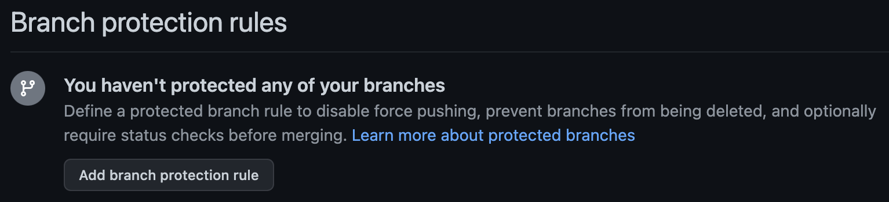
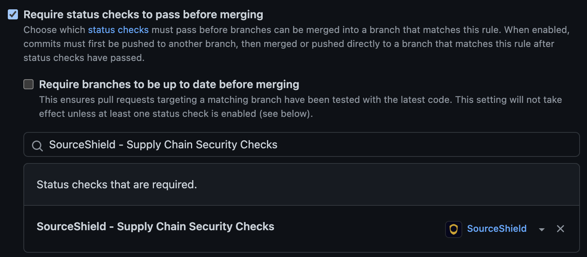
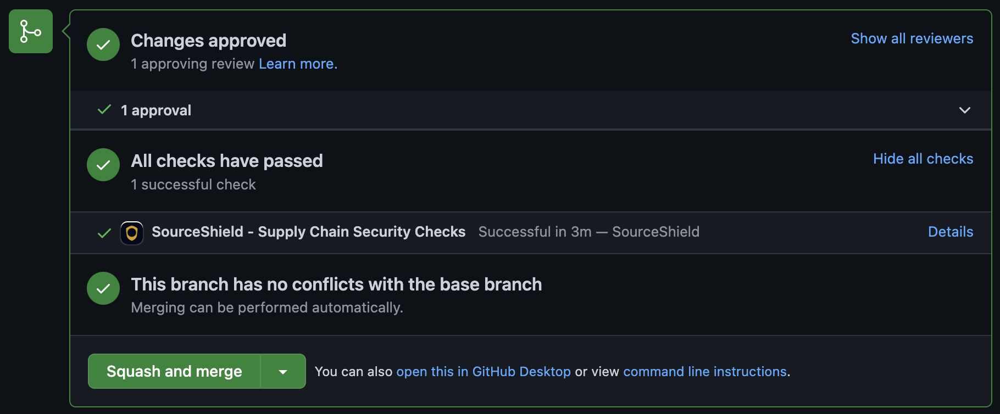

# Security Checks
{: .no_toc }

## Setting up Checks
{: .no_toc }

## Enforcing Checks on Pull Requests
{: .no_toc }

For SourceShield to effectively block pull requests until the required security checks are met, you must configure GitHub's branch protection rules accordingly, using these steps (as a GitHub repository administrator or organization owner).

{: .warning }
These steps cannot be completed until SourceShield pull request checks run at least once on the specified repository.

1. Navigate to your repository and click "Settings"
1. Under "Code and automation" select "Branches"
1. Under "Branch protection rules" click "Add branch protection rule"
  
1. Enter your branch name pattern (e.g., "main")
1. Under "Protect matching branches" check the box that says "Require a pull request before merging"
1. Check "Require status checks to pass before merging"
1. Search for the check "SourceShield - Supply Chain Security Checks" and select it
  
1. Scroll to the bottom of the page and click "Save"

Now, when a pull request is opened, SourceShield's status check must pass before the PR can be merged.


## Security Checks Reference
{: .no_toc }

1. TOC
{:toc}

<!-- ### Author Account Age
Ensures the PR author account age is not too new

```yaml
author_account_age:
  behavior: review
  config:
    min_age_days: 30
```

### Author Domain
Ensures the PR author email address belongs to an allowlisted domain

```yaml
author_domain:
  behavior: review
  config:
    allowed_domains:
    - acme.com
    - gmail.com
``` -->
